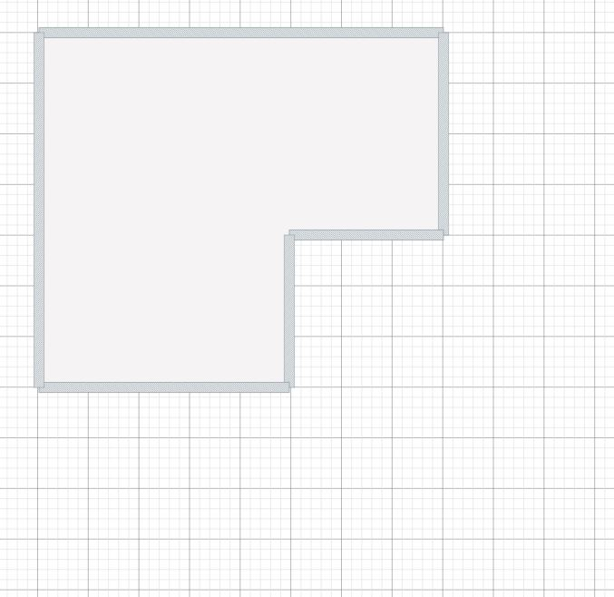
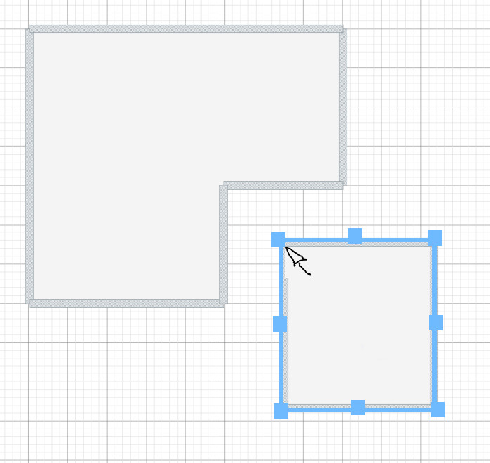
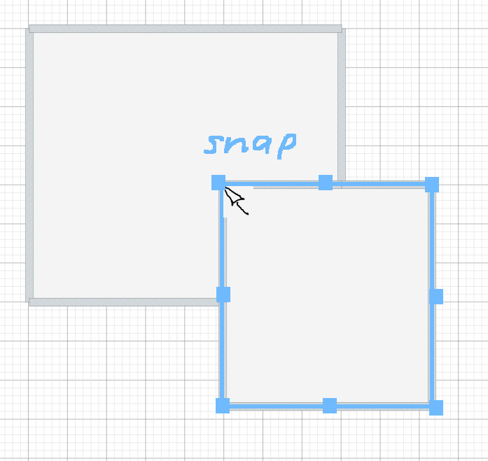
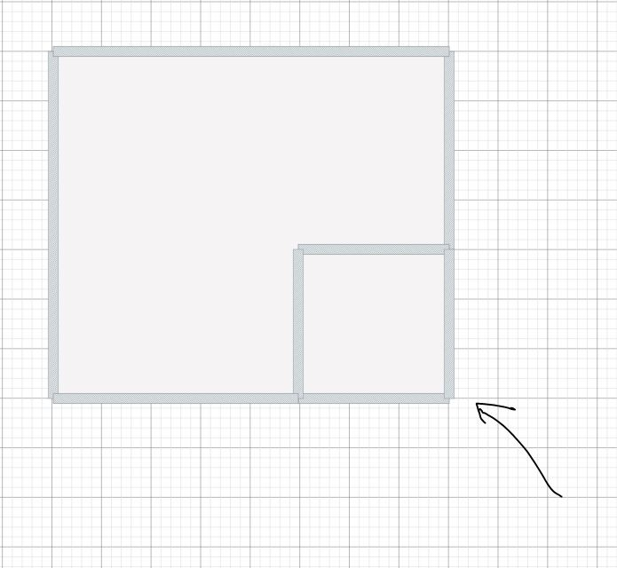
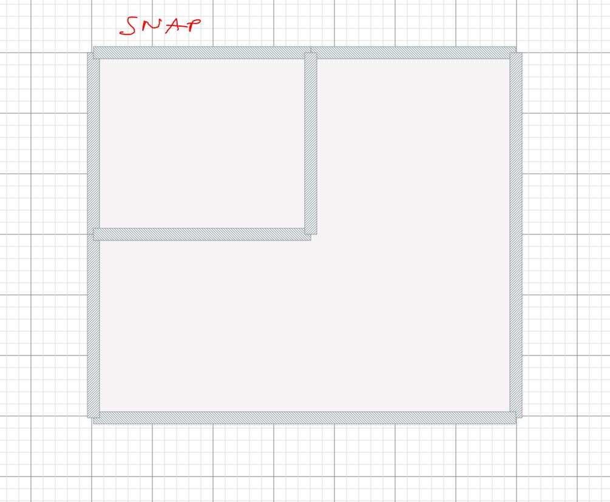

# Task_23-RoomDrawAssistant

Help floor plan drawing process with room draw feature.

- Add buttons for a few new ReactPlanner elements - rooms with different shape (consisting of walls and automatic floor/area).
- Use images included in the repo for icons/thumbnails
- Follow the react-planer's structure of the objects in catalog.
- Prepare separate object for each component in src/catalog/constructions... folder
- add controller functionality (move scale) activated by clicking on the area

UX:

1. Select from the catalog of objects

3. Glue to the cursor during dragging (for precise operation)
4. Select a room like normal element (use provided images for button images)
5. Allow inserting to the scene like a normal object (with drage and drop). Dropping by releasing the mnouse button.
6. Complete snapping functionalit, where bnew room/area can be snapped/glued to existing walls (use existing vertex snap functionality as a reference)
7. Allow for Translate, Scale, Rotate in second step (after insert). Lack of Rotate controller on images below but it should be there.
8. Allow fro internal or external attachment of rooms
9. Prevent interactions with existing walls before user accept (by clicking on the icon) (existing walls cannot be divided or replaced with newly created room befpre accept prpcess) (OK or tick icon)
10. If the new room is snapped to existing walls or it is drawn inside existing perimeter of the house inform the ser that app s going to merge rooms (new and existing one)

Internal insert:

Detachment

10. Take into consideration removal of double vertices, and double lines (don't brake existing functionality). Make it weorking with existing colapse vertices feature.
11. Use existing rect controller (for transformations) from built in wardrobe object
13. snapping to existing wall vertex
14. Show popup window on the begining of creation process for user inputs (dimensions) like in floorplan creator task
15. Add delete room functionality (click > delete key > confirm/cancel > remove from the scene)
16. Add detach room functionality (click > moving try > confirm/cancel > detach from the floorplan)
