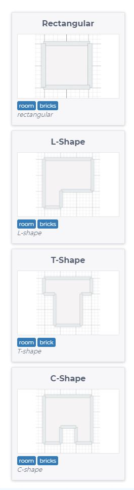

# Task_23-RoomDrawAssistant

Automate drawing process with room draw feature.

Add buttons for a few new ReactPlanner elements - rooms with different shape:

UX:

1. Select from objects catalog
2. Glue to the cursor during dragging (for precise operation)
3. Insert a room like normal element

4. Allow for Translate, Scale, Rotate in second step (after insert)
5. Take into consideration removal of double vertices, and double lines (don't brake existing functionality). Make it weorking with existing colapse vertices feature.

Additinal feartures:

- transform controllers after insert (translate, rotate, scale), like for the element
- snapping to existing wall vertex
- show popup window on the begining of creation process for user input (width,depth,rotatin,mirror). UI according to picture below:

